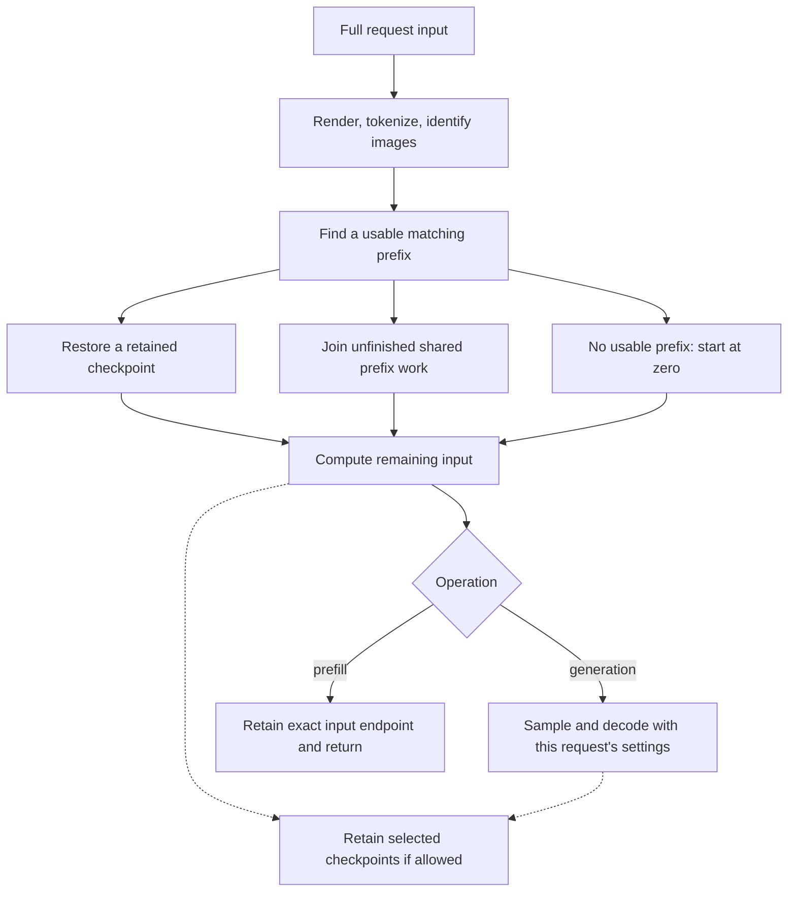
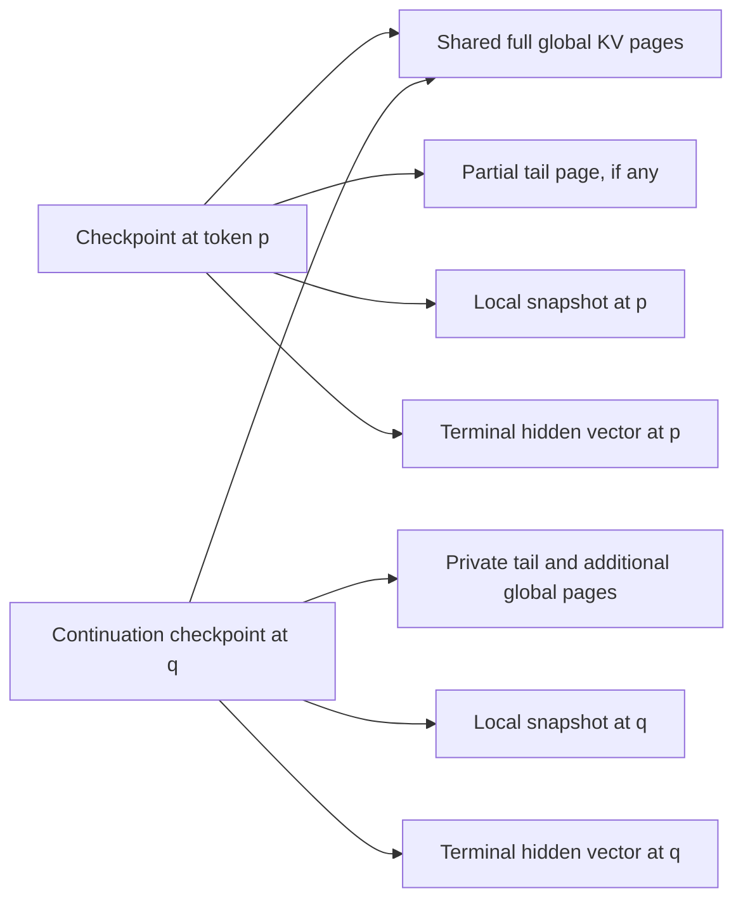
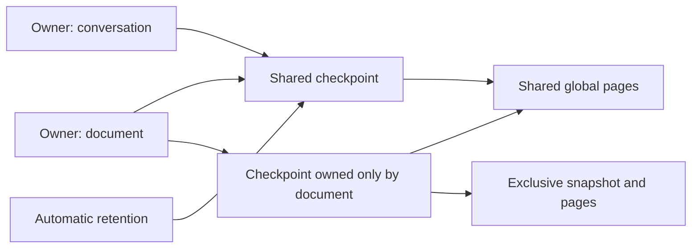
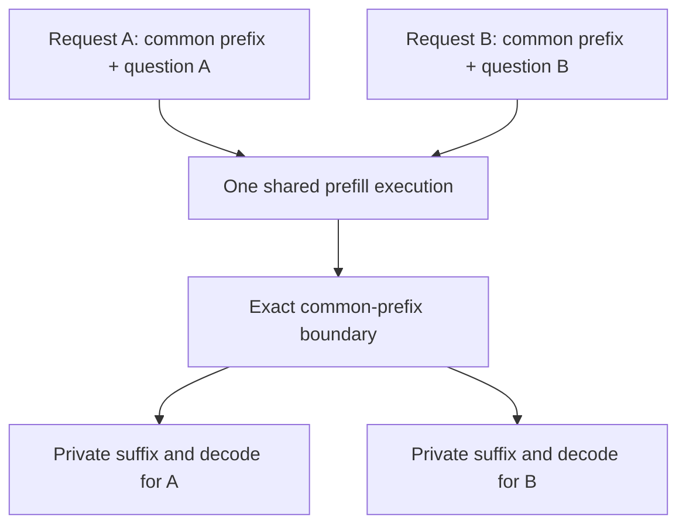
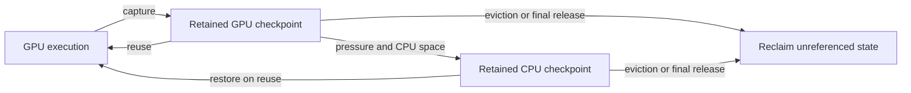

# Prefix caching and KV memory

Gewell automatically reuses matching prefixes across requests to the same
running server. A prefix cache saves model state after processing input, so a
later request can resume from that point. Each request still supplies its full
input and generates its own answer using its own sampling settings.

There are three separate decisions: **which input matches**, **which state to
retain**, and **where that state lives**. `prompt_id` and `priority` control
retention. They do not change matching or select a GPU slot.

| What you want | What to send |
|---|---|
| Normal automatic reuse and retention | Omit `cache`, or use `"cache":{"mode":"auto"}` |
| Reuse existing work without retaining your additions | `"cache":{"mode":"reuse_only"}` |
| Give a conversation or document a releasable retention owner | `"cache":{"prompt_id":"document"}` |
| Warm input before requesting an answer | `POST /v1/cache/prefill`, optionally with `cache.prompt_id` |
| Release an owner's retained state | `POST /v1/cache/finish` with a top-level `prompt_id` |
| Generate an owner's final answer and then release it | `"cache":{"prompt_id":"document","finished":true}` |

These controls apply to text and image prompts. The cache is local to one
process and its loaded model/execution configuration. Restarting the process
loses it; there is no disk or cross-server cache.

## How a request finds reusable work

The server renders chat and tokenizes input, then compares the resulting token
history with retained checkpoints and unfinished prefix work. For images, the
comparison also includes ordered image spans and identities of the prepared
image tensors. Identical placeholder tokens with different images do not match.



Reuse starts at the beginning of the input. Changing an early token prevents
reuse of the later suffix, even if that suffix is identical. The same owner ID
with different input is allowed, but only the matching prefix can be reused.
Different owner IDs, or no ID, can reuse the same state.

The runtime selects a completed checkpoint that fits the request's working
capacity, preferring a longer prefix and GPU residency on an equal-length tie.
Unfinished work can supply a longer matching prefix without waiting for a
retained checkpoint. A metadata match alone is insufficient: the required KV
and local-window state must exist, and there must be room to continue.

Sampling temperature, seed, and output limit do not change already computed
KV. The output limit does affect admission capacity. Chat template options,
tool definitions, whitespace, message history, or images can change the actual
input and therefore its matching prefix.

## What a checkpoint contains

During execution, attention reads and extends its key/value (KV) state. A
retained **checkpoint** captures everything needed to resume after an exact
number of processed input tokens:

| Component | Purpose |
|---|---|
| Input identity and prefix-index entry | Locate the matching token/image history |
| Global KV page references | Preserve attention state for the entire prefix |
| Local KV snapshot | Preserve the sliding window at this particular boundary |
| Terminal hidden vector | Compute the next-token logits on a complete prompt hit |
| Retention and lifetime metadata | Track owners, automatic retention, active users, and eviction policy |

Global attention uses 256-token pages. Gemma's compact global representation
stores the position-dependent K elements and the V vector. Local attention
uses a 1,024-token ring per execution; a checkpoint stores only its valid
window, which is smaller for a short prefix. Global and local KV can each use
BF16 or FP8 as selected at startup.



Pages inherited from an actual reused prefix are shared and counted once.
Before extending a shared partial page, the writer copies its valid contents
to a private page. This **copy on write** preserves other checkpoints and
readers. Local rings are private to continuing executions; branches restore
or copy the relevant local state.

A checkpoint becomes reusable only after its layer state and required copies
are complete. Independently recomputed KV is not merged merely because its
tokens match; sharing follows the actual reused execution state.

A later local ring cannot generally reconstruct an earlier window. If two
prompts match through token 5,000 but the deepest usable checkpoint is at
4,096, the request resumes at 4,096 and recomputes the remainder. Keeping global
pages alone does not make every token boundary resumable.

On a full prompt hit, the saved hidden vector feeds the output head and the
new request's sampler. There is no need to replay the last input token merely
to get logits, and the cached state does not contain a previously chosen answer.

## Prefill: prepare input without generating an answer

`POST /v1/cache/prefill` runs the prompt through the model and retains its exact
endpoint, without sampling or emitting completion tokens. Use it to move
expensive input processing ahead of a latency-sensitive request, or to prepare
a shared prefix before several consumers arrive. Ordinary generation already
caches automatically, so a separate warmup is optional.

**Prefill supports `prompt_id`, nested inside `cache`.** This warmup owns its
retained state under `document`:

```bash
curl -fsS http://127.0.0.1:6311/v1/cache/prefill \
  -H 'Content-Type: application/json' \
  -d '{
    "model": "gemma-4-31b",
    "messages": [{"role":"user","content":"Explain how a rainbow forms."}],
    "cache": {"prompt_id":"document","priority":"high"}
  }'
```

Use the model name configured when you [launch the server](launch.md). This
example warms one exact rendered chat input. A subsequent request can reuse it
without taking ownership of any new state:

```bash
curl -fsS http://127.0.0.1:6311/v1/chat/completions \
  -H 'Content-Type: application/json' \
  -d '{
    "model": "gemma-4-31b",
    "messages": [{"role":"user","content":"Explain how a rainbow forms."}],
    "max_tokens": 128,
    "cache": {"mode":"reuse_only"}
  }'
```

The warmup's `document` owner remains until released or its state is evicted.
There is no need to send that ID to benefit from its prefix.

### Prefill request and response

Supply exactly one of `messages` or `prompt`. `messages` uses the same chat
rendering and image support as Chat Completions, including `tools`,
`tool_choice`, `parallel_tool_calls`, and `chat_template_kwargs`. `prompt`
accepts a string or a token-ID array as in Completions. `model` is optional
for this endpoint; if supplied, it must match the served model.

Prefill requires `cache.mode:"auto"` and `cache.finished:false`, both defaults.
It accepts `cache.prompt_id` and `cache.priority`. It rejects generation
controls such as `max_tokens`, `temperature`, `seed`, and `stream`, as well as
other unrecognized top-level fields. In particular, a **top-level** `prompt_id`
is rejected here.

A successful response has:

| Field | Meaning |
|---|---|
| `usage.prompt_tokens` | Full prepared input length |
| `usage.completion_tokens` | `0` |
| `usage.total_tokens` | Equal to `prompt_tokens` |
| `usage.prompt_tokens_details.cached_tokens` | Input supplied by prior state or shared work |
| `checkpoint_tokens` | Exact processed input length |
| `retained` | `true`; the endpoint was retained at completion |
| `prompt_id` | Supplied owner ID, or `null` for automatic retention |

The endpoint can reuse an existing checkpoint or join shared prefill work.
It returns a capacity error if it cannot retain the endpoint. Successful warmup
does not guarantee residency until the next request: later pressure can evict
even a named, high-priority checkpoint.

### Warming a common prefix

Warm a prefix of the **actual tokenized input** of future requests. Rendering
a system-only chat separately can append different template delimiters, so it
may not be an exact prefix of a later multi-message chat. Even raw string
concatenation can change BPE tokens at the join.

If the client prepares exact token IDs, `prompt:[2,105,106]` can warm the first
three IDs of a later `prompt:[2,105,106,107]`. These are illustrative IDs; use
the real prefix from the full rendered/tokenized input. Token-array input is
used verbatim. String input receives the normal raw-prompt BOS handling.

HTTP prefill does not accept arbitrary checkpoint offsets. Resident
[JSONL jobs](offline.md#resident-jsonl-jobs) can nominate `checkpoint_offsets`
within their prepared prompt, outside image spans.

## Named retention and release

The `cache` object on both generation endpoints has these fields. Omission or
`null` selects the defaults; unknown fields inside the object are rejected.

| Field | Default | Meaning |
|---|---|---|
| `mode` | `"auto"` | Allow reuse and retention, or select `"reuse_only"` |
| `prompt_id` | `null` | Retention owner: a nonempty UTF-8 string, at most 128 bytes, without NUL |
| `priority` | `"normal"` | Retention preference: `"low"`, `"normal"`, or `"high"` |
| `finished` | `false` | Release this named owner after the admitted request terminates |

An owner is a label on retention demands, not stored conversation content.
You still send the complete messages or prompt on every request. One owner
can retain multiple checkpoints and branches. Using the ID again does not
automatically delete its older checkpoints or allocate another copy of matching
state. The ID is local to the process, not an authentication or persistence key.

Anonymous `auto` requests create automatic retention demands. Named `auto`
requests attach their owner to reused and newly retained checkpoints. Another
named request can attach a second owner, and an anonymous `auto` request can
give a reused checkpoint an automatic lifetime. `reuse_only` does neither.



Release the warmup with:

```bash
curl -fsS http://127.0.0.1:6311/v1/cache/finish \
  -H 'Content-Type: application/json' \
  -d '{"prompt_id":"document"}'
```

The response is `{"prompt_id":"document","released":true}`. Here the ID is
**top-level**, and it is the only accepted request field. Finish is idempotent,
including for an unknown or already evicted owner.

In the diagram, releasing `document` removes its two demands. The shared
checkpoint survives because other demands remain. The exclusively owned
checkpoint becomes reclaimable; its shared pages survive while referenced
elsewhere. Active readers and transfers also hold references until their work
is safe to release. Explicitly discarded state is removed from both GPU and
CPU storage, rather than being spilled to keep it alive.

Generation with `cache.finished:true` requires an ID. It suppresses new
retention for that request and releases the owner's existing demands when
the admitted operation ends, including cancellation or execution failure.
Invalid requests and requests rejected before compute admission do not release
the owner. EOS alone never finishes an owner.

Operations for the same ID, including prefill and finish, run in server
acceptance order. This prevents a finish from overtaking an earlier operation
for that owner. Requests with different IDs can run concurrently and still
share matching prefixes. Retention priority does not set execution priority.

## What `reuse_only` does

`"cache":{"mode":"reuse_only"}` allows lookup and shared execution but does
not admit new retained state for the request. It is useful for one-off branches
or repeated sampling from a separately warmed document without filling the
cache with each answer.

On a miss it computes normally. It does not mean “fail unless cached,” disable
caching, or bypass the GPU memory budget. Its private working KV is allocated
while it runs, then released. Existing checkpoints can still be marked as used,
restored from CPU, or migrated under pressure. Other requests sharing the work
may retain state according to their own controls.

It requires omitted/null `prompt_id`, default/normal priority, and
`finished:false`. Combining `reuse_only` with a named owner is a request error.
Use the separate finish endpoint to release an owner.

## Sharing unfinished prefixes

The scheduler also avoids duplicate prefill when matching requests overlap in
time. Queued requests register their token/image paths before GPU admission;
they can join an existing path provided dispatch has not advanced beyond their
common-prefix boundary.



Known branch boundaries split text chunks exactly. Branches share global pages
and get the correct local state. The final dependent can take over the live
execution instead of copying it. A compact checkpoint can bridge a handoff
when keeping a full live ring would block progress. Exact-prompt consumers
requesting only one output token can sample from the shared hidden vector
without allocating a private continuation.

Cancelling the request that first created the work removes that consumer; it
does not cancel surviving consumers. Shared execution is released after the
last dependent leaves and outstanding device work is safe. A late request
whose divergence falls inside an already dispatched or completed chunk may
need to resume from an earlier checkpoint and replay. Identical input does not
promise every arrival will avoid all duplicate work.

Image spans are processed whole. Checkpoints and branch boundaries cannot
split an image's feature span. Earlier matching images and text can still be
reused when a later image changes.

## When checkpoints are kept

The runtime considers four checkpoint sources:

| Source | Why keep it? |
|---|---|
| Input endpoint | Retry or regenerate from the same input |
| Continuation endpoint | Extend a conversation through already processed output |
| Learned branch | Reuse a shared boundary discovered between diverging inputs, including safe image boundaries |
| Periodic | Bound replay along long prompts and generations while coverage remains retained |

Ordinary generation captures opportunistically within the budgets. Prefill
requires its exact endpoint. A matching token boundary does not manufacture
missing local state: a learned checkpoint is captured when computation reaches
that boundary. There is no background replay to create speculative entries.

The default periodic interval is 8,192 processed tokens. Setting
`--kv-checkpoint-interval-tokens 0` disables periodic captures, while endpoint
and learned-branch capture and lookup remain enabled. Periodic boundaries are
independent of the text prefill chunk size and the 256-token global page size;
checkpoints can fall inside a page.

To limit snapshot cost, ordinary automatic captures with a full local window
are skipped when an existing checkpoint is less than 1,024 tokens behind.
Named captures, short compact snapshots, and explicit prefill endpoints are
exempt from that spacing rule. Unreused periodic entries are thinned to at most
eight per unbranched path, gradually coarsening older coverage.

Checkpoint length counts **processed** tokens. For `P` prompt tokens and `N`
generated decisions, the final processed boundary is normally `P + N - 1`:
the last selected token has not been fed back through the model. A subsequent
request must process that token. Speculative MTP proposals only enter committed
cache history through accepted execution; rejected draft state is private
staging, not a reusable prefix.

## GPU storage, CPU storage, and eviction

Active execution needs GPU KV. Idle checkpoints can remain on GPU or spill to
the optional CPU pool, then be restored when reused. CPU storage extends the
amount of retained history; it does not let an active request exceed the GPU
working capacity or the model's context limit.



CPU copies preserve the same KV representation. Shared global pages are copied
and counted once per tier; useful CPU backing can survive a restore and avoid
being copied again on a later spill. Restoring still costs transfer time, so a
cache hit can be slower than an entirely GPU-resident hit.

Eviction considers idle, unprotected checkpoints. Active executions, transfers,
and required handoffs protect state until it is safe to release. Retention
demands express a preference; neither an owner ID nor high priority pins state
forever.

Under GPU pressure, the policy first considers redundant, unreused checkpoints
with a nearby retained ancestor, coarsening dense coverage before the general
CLOCK scan. That scan visits low, normal, then high priority; within a priority
it favors evicting probationary entries over reused ones and gives recently
referenced entries a second chance. Reused entries have a soft 75% target by
reclaimable bytes, rather than a permanent protected allocation. Shared demands
give a checkpoint their strongest current priority.

Eligible GPU state spills only if CPU storage can accommodate it. CPU pressure
can remove lower-value idle entries; otherwise the incoming spill can be
declined and the GPU checkpoint discarded. Releasing an owner also reclaims
state that has no remaining demand or active reference. Removing one checkpoint
does not free global pages still shared by another.

### Budgets and admission

| Setting | Default | Pays for |
|---|---|---|
| `--kv-cache-gpu-mib` | Required | GPU cache pool plus fixed prefix-hidden and MTP staging |
| `--kv-cache-cpu-mib` | `0` | CPU retained KV and checkpoint payloads; zero disables this tier |
| `--kv-cache-index-mib` | `512` | Host token/image index, page/owner records, and bookkeeping |
| `--kv-local-format`, `--kv-global-format` | `bf16` | KV representation; `fp8` changes capacity and numerical behavior |

All memory flags use MiB (1,048,576 bytes). Inside the GPU pool are shared
global pages, private local rings and page tables, retained local snapshots,
terminal state, and temporary copies. Model weights, general executor/vision
scratch, and output buffers also need device memory outside that pool. See the
[CLI reference](cli.md#execution-and-cache) for the full settings.

If the host prefix index fills, idle checkpoints are removed from either GPU
or CPU storage to free their index entries. Spilling alone preserves those
entries. Index pressure can therefore evict retained KV while the payload
pools still have free space.

Admission reserves room for the request's declared maximum processed horizon
and private growth, including restoration and copy-on-write costs. A request
may wait while other executions hold capacity. One that cannot fit by itself
is rejected; active execution is not evicted to make it fit. A large
`max_tokens` can therefore reduce concurrency even if the model often stops
early. Optional retained entries cannot consume another execution's reserved
growth, and enough total free bytes does not always imply a suitable allocation
fits.

## How this differs from vLLM

Both engines automatically reuse matching input prefixes. This comparison
uses vLLM V1's documented built-in GPU prefix cache, checked on 2026-09-17;
optional offloading has separate policies.

| Aspect | vLLM | Gewell |
|---|---|---|
| Reuse boundary | Hashes complete KV blocks using their tokens, preceding prefix, and input identity. Only full blocks are cached. [APC design](https://docs.vllm.ai/en/stable/design/prefix_caching/) | Resumes selected checkpoints with global pages, a local snapshot, and terminal hidden state. Boundaries can fall inside a page; matching tokens between checkpoints may need replay. |
| Sliding-window state | Caches attention groups independently, frees blocks outside the live window, and finds a prefix usable by all groups. [Hybrid cache design](https://docs.vllm.ai/en/stable/design/hybrid_kv_cache_manager/#prefix-caching) | Keeps a live local ring and selected snapshots at resumable boundaries. |
| GPU eviction | Uses an LRU free-block queue; blocks still referenced by active requests are protected. [Eviction policy](https://docs.vllm.ai/en/stable/design/prefix_caching/#eviction-lru) | Evicts eligible idle checkpoints: first thin redundant coverage, then use priority-aware CLOCK with probationary/reused classes and second chances. |
| Names and lifecycle | Content determines reuse; `cache_salt` partitions which requests can share blocks. [Cache isolation](https://docs.vllm.ai/en/stable/design/prefix_caching/) | `prompt_id` adds releasable ownership without partitioning sharing. Prefill warms state, `reuse_only` avoids retaining additions, and finish releases an owner's demands. |

Both support CPU cache storage. vLLM's optional
[OffloadingConnector](https://docs.vllm.ai/en/stable/features/kv_offloading_usage/)
can copy completed blocks as they are produced and has its own LRU, ARC, or
custom eviction policy. Gewell spills eligible checkpoints under GPU pressure
into its bounded CPU tier, preserving their existing ownership and release
rules. Thus `prompt_id` is not equivalent to vLLM's `cache_salt`, and GPU LRU
does not describe every vLLM offload configuration.

## Checking whether reuse worked

Buffered generation responses include
`usage.prompt_tokens_details.cached_tokens`. For streaming, request
`stream_options:{"include_usage":true}` to receive final usage.

This count includes input supplied by retained checkpoints **and shared
unfinished work**. GPU and restored CPU prefixes count the same way. It is
bounded by the full `prompt_tokens`; caching does not subtract tokens from
`prompt_tokens` or `total_tokens`. Writing a new checkpoint does not itself
count as a hit.

| Surface | What it tells you |
|---|---|
| `GET /v1/cache/stats` | Aggregate GPU/CPU/index capacities and use, checkpoints, executions, and copy-on-write count |
| `GET /v1/cache/index` | Checkpoint lengths, tiers, source types, priorities, reuse counts, ancestors, references, and active execution inventory |
| `GET /metrics` | Token hit/compute counters, memory use, checkpoint lifecycle, and spill/restore traffic and time |

Inventory checkpoint IDs identify internal snapshots and are separate from
client-supplied `prompt_id` owner labels.

`gewell:shared_prompt_tokens_total` isolates the shared-work part of cache-hit
accounting. `gewell:prefill_tokens_total` counts physical prompt computation,
including explicit prefill and cancelled work; the `vllm:` request/token series
cover generation requests. These counters have different scopes.

Inventory `referenced_bytes` can include global pages shared by multiple
checkpoints; summing those entries double-counts memory. Use pool totals for
physical occupancy and `reclaimable_bytes` to understand pressure. Releasing
state makes pool space reusable; the preallocated pool need not disappear from
GPU memory monitoring.

If reuse is less than expected, check the exact rendered input and image
identities, the deepest surviving checkpoint, and spill/removal activity. A
warmup can have been evicted, a local snapshot may be missing at the matching
boundary, or a late arrival may require replay. A name alone cannot repair
any of those misses.
